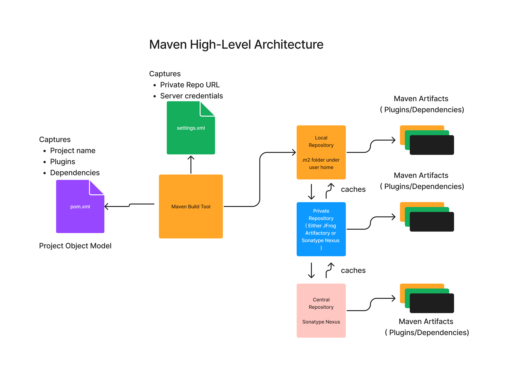
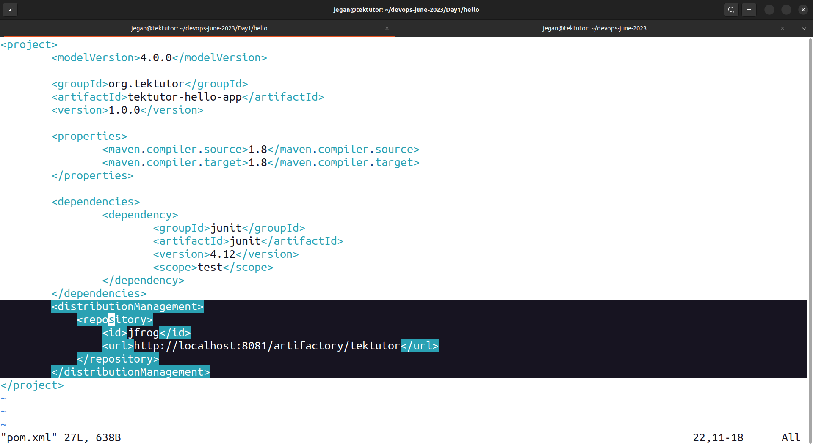
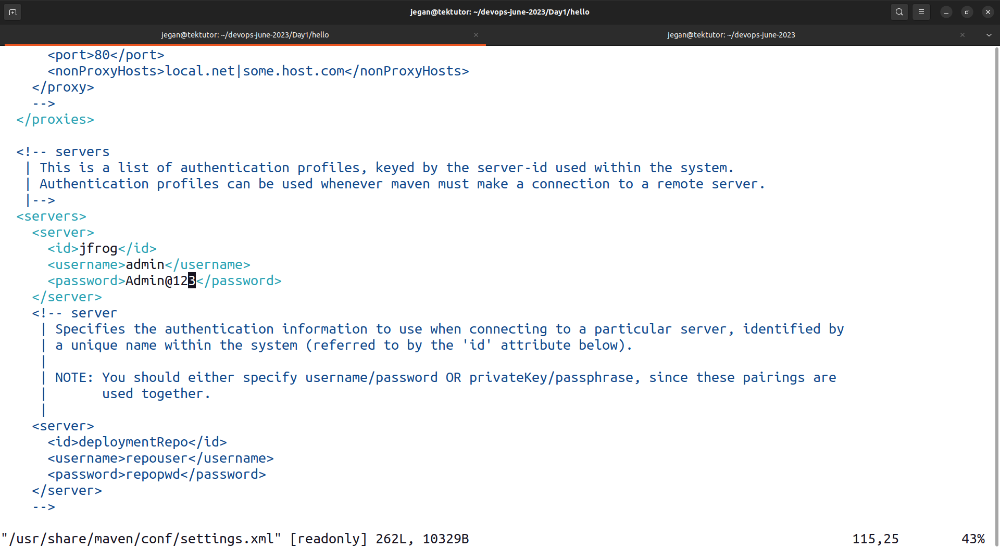
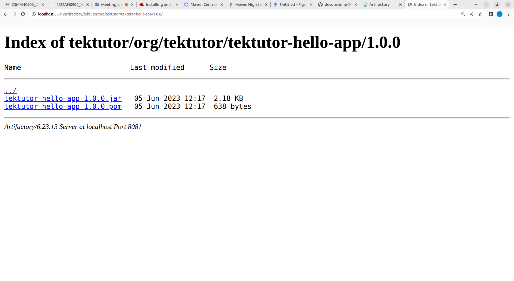

# Day 1

## What is DevOps?

- Test Driven Devopment 
  - Java
    - Junit, Mockito, TestNg, PowerMockito(Not Recommended)
  - C#
    - NUnit, Moq
  - C/C++
    - CppUnit, CUnit
    - Google Test & Google Mock
  - Python
    - Pytest
- Behavior Driven Development
   - Java
     - Cucumber
   - C++
     - Cucumber
   - C#
     - Specflow
   - JavaScript
     - Jasmine, Karma
   - Python
- Tools used by Operations Team ( Administrators to automate )
  - Configuration Management Tools ( Ansible, Puppet, Chef, Salt/Saltstack, etc.,)
  - Infrastructure as a Code Tools (Terraform, Cloudformation, etc.,)

## What is Continuous Integration (CI)?

## What is Continuous Deployment (CD)?

## What is Continuous Delivery (CD)?

# Maven Overview
- a build tool used in Java based projects
- this is an alternate tool for Apache Ant
- an opensource tool from Apache Foundation
- is programming agnostic/independent tool
- however used mostly by Java based project
- Supports Dependency Management
- Maven has conventions for everything
  - has conventions on how to name your project
  - has conventions on project directory structure
  - has conventions for versioning your artifacts (components)
- Convention Over Configuration
  - Based on 80-20 Principle
  - In Maven, the most commonly used features can be utilized with less/no extra configuration
  - at the same time, the advanced scenarios are also supposed with some extra configuration
- Maven co-ordinates
  - ArtifactId ( name of the jar/war/ear/zip )
  - GroupId ( similar to package/namespace - usually your organization reverse domain name )
  - Version ( 1.2.3 )
    - 1 represents the major version
    - 2 represents the minor version
    - 3 represents the incremental version

## Maven High-Level Architecture


# Maven Commands

## Finding the maven version
```
mvn --version
```

Expected output
<pre>
[jegan@tektutor.org devops-june-2023]$ <b>mvn --version</b>
Apache Maven 3.6.3 (Red Hat 3.6.3-10.3)
Maven home: /usr/share/maven
Java version: 11.0.18, vendor: Red Hat, Inc., runtime: /usr/lib/jvm/java-11-openjdk-11.0.18.0.10-2.el8_7.x86_64
Default locale: en_US, platform encoding: UTF-8
OS name: "linux", version: "4.18.0-425.10.1.el8_7.x86_64", arch: "amd64", family: "unix"
</pre>

## Cloning TekTutor Training Repository
```
cd ~
git clone https://github.com/tektutor/devops-june-2023.git
cd devops-june-2023
```

## ⛹️‍♂️ Lab - Validate the hello pom.xml
```
cd ~/devops-june-2023
git pull
cd Day1/hello

mvn validate
```

Expected output
<pre>
[jegan@tektutor.org hello]$ <b>mvn validate</b>
[INFO] Scanning for projects...
[INFO] 
[INFO] ------------------< org.tektutor:tektutor-hello-app >-------------------
[INFO] Building tektutor-hello-app 1.0.0
[INFO] --------------------------------[ jar ]---------------------------------
[INFO] ------------------------------------------------------------------------
[INFO] BUILD SUCCESS
[INFO] ------------------------------------------------------------------------
[INFO] Total time:  0.032 s
[INFO] Finished at: 2023-06-05T13:00:31+05:30
[INFO] ------------------------------------------------------------------------
</pre>

## ⛹️‍♂️ Lab - Compiling the Hello maven project
```
cd ~/devops-june-2023
git pull

cd Day1/hello
mvn compile
```

Expected output
<pre>
[jegan@tektutor.org hello]$ <b>mvn compile</b>
[INFO] Scanning for projects...
[INFO] 
[INFO] ------------------< org.tektutor:tektutor-hello-app >-------------------
[INFO] Building tektutor-hello-app 1.0.0
[INFO] --------------------------------[ jar ]---------------------------------
[INFO] 
[INFO] --- maven-resources-plugin:2.6:resources (default-resources) @ tektutor-hello-app ---
[WARNING] Using platform encoding (UTF-8 actually) to copy filtered resources, i.e. build is platform dependent!
[INFO] skip non existing resourceDirectory /home/jegan/devops-june-2023/Day1/hello/src/main/resources
[INFO] 
[INFO] --- maven-compiler-plugin:3.1:compile (default-compile) @ tektutor-hello-app ---
[INFO] Changes detected - recompiling the module!
[WARNING] File encoding has not been set, using platform encoding UTF-8, i.e. build is platform dependent!
[INFO] Compiling 1 source file to /home/jegan/devops-june-2023/Day1/hello/target/classes
[INFO] -------------------------------------------------------------
[ERROR] COMPILATION ERROR : 
[INFO] -------------------------------------------------------------
[ERROR] Source option 5 is no longer supported. Use 6 or later.
[ERROR] Target option 1.5 is no longer supported. Use 1.6 or later.
[INFO] 2 errors 
[INFO] -------------------------------------------------------------
[INFO] ------------------------------------------------------------------------
[INFO] BUILD FAILURE
[INFO] ------------------------------------------------------------------------
[INFO] Total time:  0.318 s
[INFO] Finished at: 2023-06-05T13:01:21+05:30
[INFO] ------------------------------------------------------------------------
[ERROR] Failed to execute goal org.apache.maven.plugins:maven-compiler-plugin:3.1:compile (default-compile) on project tektutor-hello-app: Compilation failure: Compilation failure: 
[ERROR] Source option 5 is no longer supported. Use 6 or later.
[ERROR] Target option 1.5 is no longer supported. Use 1.6 or later.
[ERROR] -> [Help 1]
[ERROR] 
[ERROR] To see the full stack trace of the errors, re-run Maven with the -e switch.
[ERROR] Re-run Maven using the -X switch to enable full debug logging.
[ERROR] 
[ERROR] For more information about the errors and possible solutions, please read the following articles:
[ERROR] [Help 1] http://cwiki.apache.org/confluence/display/MAVEN/MojoFailureException
</pre>

The root cause of the above problem is that, my maven version 3.6.3 makes use of maven-compiler-plugin version 3.1 which was released in year 2013.  Hence, the maven-compiler-plugin seems to restrict the java compiler feature set to JDK/JRE version 1.5.

So we could solve the issue in two different ways.
1. We could instruct the maven-compiler-plugin to use JDK/JRE( source and target compiler switches ) to 1.8.
2. Alternatively, we could upgrade the maven-compiler-plugin to latest available in the maven central repository which will resolve the problem in your current project.

After the fix, maven compile output looks as shown below
<pre>
[jegan@tektutor.org hello]$ <b>mvn compile</b>
[INFO] Scanning for projects...
[INFO] 
[INFO] ------------------< org.tektutor:tektutor-hello-app >-------------------
[INFO] Building tektutor-hello-app 1.0.0
Downloading from central: https://repo.maven.apache.org/maven2/org/codehaus/plexus/plexus-utils/3.4.1/plexus-utils-3.4.1.jar
Downloaded from central: https://repo.maven.apache.org/maven2/org/apache/maven/shared/maven-shared-utils/3.3.4/maven-shared-utils-3.3.4.jar (153 kB at 517 kB/s)
Downloading from central: https://repo.maven.apache.org/maven2/org/codehaus/plexus/plexus-compiler-manager/2.11.1/plexus-compiler-manager-2.11.1.jar
Downloaded from central: https://repo.maven.apache.org/maven2/org/codehaus/plexus/plexus-compiler-api/2.11.1/plexus-compiler-api-2.11.1.jar (27 kB at 83 kB/s)
Downloading from central: https://repo.maven.apache.org/maven2/org/codehaus/plexus/plexus-compiler-javac/2.11.1/plexus-compiler-javac-2.11.1.jar
Downloaded from central: https://repo.maven.apache.org/maven2/com/thoughtworks/qdox/qdox/2.0.1/qdox-2.0.1.jar (334 kB at 810 kB/s)
Downloaded from central: https://repo.maven.apache.org/maven2/org/codehaus/plexus/plexus-compiler-javac/2.11.1/plexus-compiler-javac-2.11.1.jar (23 kB at 55 kB/s)
Downloaded from central: https://repo.maven.apache.org/maven2/org/codehaus/plexus/plexus-utils/3.4.1/plexus-utils-3.4.1.jar (264 kB at 583 kB/s)
Downloaded from central: https://repo.maven.apache.org/maven2/org/codehaus/plexus/plexus-compiler-manager/2.11.1/plexus-compiler-manager-2.11.1.jar (4.7 kB at 9.4 kB/s)
Downloaded from central: https://repo.maven.apache.org/maven2/commons-io/commons-io/2.6/commons-io-2.6.jar (215 kB at 269 kB/s)
[INFO] Changes detected - recompiling the module!
[WARNING] File encoding has not been set, using platform encoding UTF-8, i.e. build is platform dependent!
[INFO] Compiling 1 source file to /home/jegan/devops-june-2023/Day1/hello/target/classes
[INFO] ------------------------------------------------------------------------
[INFO] BUILD SUCCESS
[INFO] ------------------------------------------------------------------------
[INFO] Total time:  5.664 s
[INFO] Finished at: 2023-06-05T13:19:55+05:30
[INFO] ------------------------------------------------------------------------
</pre>

## ⛹️‍♂️ Lab - Find maven plugin help details
```
mvn help:describe -Dplugin=org.apache.maven.plugins:maven-surefire-plugin:2.12.4 -Ddetail
```

Expected output
<pre>
jegan@tektutor:~/devops-june-2023/Day1/hello$ <b>mvn help:describe -Dplugin=org.apache.maven.plugins:maven-surefire-plugin:2.12.4 -Ddetail</b>
[INFO] Scanning for projects...
[INFO] 
[INFO] ------------------< org.tektutor:tektutor-hello-app >-------------------
[INFO] Building tektutor-hello-app 1.0.0
[INFO] --------------------------------[ jar ]---------------------------------
[INFO] 
[INFO] --- maven-help-plugin:3.4.0:describe (default-cli) @ tektutor-hello-app ---
Downloading from central: https://repo.maven.apache.org/maven2/org/apache/maven/wagon/wagon-provider-api/1.0-beta-2/wagon-provider-api-1.0-beta-2.pom
Downloaded from central: https://repo.maven.apache.org/maven2/org/apache/maven/wagon/wagon-provider-api/1.0-beta-2/wagon-provider-api-1.0-beta-2.pom (680 B at 2.1 kB/s)
Downloading from central: https://repo.maven.apache.org/maven2/org/apache/maven/wagon/wagon/1.0-beta-2/wagon-1.0-beta-2.pom
Downloaded from central: https://repo.maven.apache.org/maven2/org/apache/maven/wagon/wagon/1.0-beta-2/wagon-1.0-beta-2.pom (5.9 kB at 190 kB/s)
Downloading from central: https://repo.maven.apache.org/maven2/org/apache/maven/maven-parent/4/maven-parent-4.pom
Downloaded from central: https://repo.maven.apache.org/maven2/org/apache/maven/maven-parent/4/maven-parent-4.pom (10.0 kB at 256 kB/s)
Downloading from central: https://repo.maven.apache.org/maven2/org/apache/maven/wagon/wagon-provider-api/1.0-beta-2/wagon-provider-api-1.0-beta-2.jar
Downloaded from central: https://repo.maven.apache.org/maven2/org/apache/maven/wagon/wagon-provider-api/1.0-beta-2/wagon-provider-api-1.0-beta-2.jar (46 kB at 759 kB/s)
[INFO] org.apache.maven.plugins:maven-surefire-plugin:2.12.4

Name: Maven Surefire Plugin
Description: Surefire is a test framework project.
Group Id: org.apache.maven.plugins
Artifact Id: maven-surefire-plugin
Version: 2.12.4
Goal Prefix: surefire

This plugin has 2 goals:

surefire:help
  Description: Display help information on maven-surefire-plugin.
    Call mvn surefire:help -Ddetail=true -Dgoal=<goal-name> to display
    parameter details.
  Implementation: org.apache.maven.plugin.surefire.HelpMojo
  Language: java

  Available parameters:

    detail (Default: false)
      User property: detail
      If true, display all settable properties for each goal.

    goal
      User property: goal
      The name of the goal for which to show help. If unspecified, all goals
      will be displayed.

    indentSize (Default: 2)
      User property: indentSize
      The number of spaces per indentation level, should be positive.

    lineLength (Default: 80)
      User property: lineLength
      The maximum length of a display line, should be positive.

surefire:test
  Description: Run tests using Surefire.
  Implementation: org.apache.maven.plugin.surefire.SurefirePlugin
  Language: java
  Bound to phase: test

  Available parameters:

    additionalClasspathElements
      Additional elements to be appended to the classpath.

    argLine
      User property: argLine
      Arbitrary JVM options to set on the command line.

    basedir (Default: ${basedir})
      The base directory of the project being tested. This can be obtained in
      your integration test via System.getProperty("basedir").

    childDelegation (Default: false)
      User property: childDelegation
      When false it makes tests run using the standard classloader delegation
      instead of the default Maven isolated classloader. Only used when forking
      (forkMode is not "none").
      Setting it to false helps with some problems caused by conflicts between
      xml parsers in the classpath and the Java 5 provider parser.

    classesDirectory (Default: ${project.build.outputDirectory})
      The directory containing generated classes of the project being tested.
      This will be included after the test classes in the test classpath.

    classpathDependencyExcludes
      List of dependencies to exclude from the test classpath. Each dependency
      string must follow the format groupId:artifactId. For example:
      org.acme:project-a

    classpathDependencyScopeExclude
      A dependency scope to exclude from the test classpath. The scope should
      be one of the scopes defined by org.apache.maven.artifact.Artifact. This
      includes the following:
      
      
      * compile - system, provided, compile
      * runtime - compile, runtime
      * compile+runtime - system, provided, compile, runtime
      * runtime+system - system, compile, runtime
      * test - system, provided, compile, runtime, test

    debugForkedProcess
      User property: maven.surefire.debug
      Attach a debugger to the forked JVM. If set to "true", the process will
      suspend and wait for a debugger to attach on port 5005. If set to some
      other string, that string will be appended to the argLine, allowing you
      to configure arbitrary debuggability options (without overwriting the
      other options specified through the argLine parameter).

    disableXmlReport (Default: false)
      User property: disableXmlReport
      Flag to disable the generation of report files in xml format.

    enableAssertions (Default: true)
      User property: enableAssertions
      By default, Surefire enables JVM assertions for the execution of your
      test cases. To disable the assertions, set this flag to "false".

    environmentVariables
      Additional environment variables to set on the command line.

    excludedGroups
      User property: excludedGroups
      (TestNG/JUnit47 provider with JUnit4.8+ only) Excluded groups. Any
      methods/classes/etc with one of the groups specified in this list will
      specifically not be run.
      For JUnit, this parameter forces the use of the 4.7 provider
      This parameter is ignored if the suiteXmlFiles parameter is specified.

    excludes
      A list of <exclude> elements specifying the tests (by pattern) that
      should be excluded in testing. When not specified and when the test
      parameter is not specified, the default excludes will be
      <excludes>
      <exclude>**/*$*</exclude>
      </excludes>
      (which excludes all inner classes).
      This parameter is ignored if the TestNG suiteXmlFiles parameter is
      specified.
      
      Each exclude item may also contain a comma-separated sublist of items,
      which will be treated as multiple <exclude> entries.

    failIfNoSpecifiedTests
      User property: surefire.failIfNoSpecifiedTests
      Set this to "true" to cause a failure if the none of the tests specified
      in -Dtest=... are run. Defaults to "true".

    failIfNoTests
      User property: failIfNoTests
      Set this to "true" to cause a failure if there are no tests to run.
      Defaults to "false".

    forkedProcessTimeoutInSeconds
      User property: surefire.timeout
      Kill the forked test process after a certain number of seconds. If set to
      0, wait forever for the process, never timing out.

    forkMode (Default: once)
      User property: forkMode
      Option to specify the forking mode. Can be "never", "once", "always" or
      "perthread". "none" and "pertest" are also accepted for backwards
      compatibility. "always" forks for each test-class. "perthread" will
      create "threadCount" parallel forks.

    groups
      User property: groups
      (TestNG/JUnit47 provider with JUnit4.8+ only) Groups for this test. Only
      classes/methods/etc decorated with one of the groups specified here will
      be included in test run, if specified.
      For JUnit, this parameter forces the use of the 4.7 provider
      This parameter is ignored if the suiteXmlFiles parameter is specified.

    includes
      A list of <include> elements specifying the tests (by pattern) that
      should be included in testing. When not specified and when the test
      parameter is not specified, the default includes will be
      <includes>
      <include>**/IT*.java</include>
      <include>**/*IT.java</include>
      <include>**/*ITCase.java</include>
      </includes>
      
      
      Each include item may also contain a comma-separated sublist of items,
      which will be treated as multiple <include> entries.
      
      
      This parameter is ignored if the TestNG suiteXmlFiles parameter is
      specified.

    junitArtifactName (Default: junit:junit)
      User property: junitArtifactName
      Allows you to specify the name of the JUnit artifact. If not set,
      junit:junit will be used.

    jvm
      User property: jvm
      Option to specify the jvm (or path to the java executable) to use with
      the forking options. For the default, the jvm will be a new instance of
      the same VM as the one used to run Maven. JVM settings are not inherited
      from MAVEN_OPTS.

    objectFactory
      User property: objectFactory
      (TestNG only) Define the factory class used to create all test instances.

    parallel
      User property: parallel
      (TestNG only) When you use the parallel attribute, TestNG will try to run
      all your test methods in separate threads, except for methods that depend
      on each other, which will be run in the same thread in order to respect
      their order of execution.
      
      (JUnit 4.7 provider) Supports values "classes"/"methods"/"both" to run in
      separate threads, as controlled by threadCount.

    perCoreThreadCount (Default: true)
      User property: perCoreThreadCount
      (JUnit 4.7 provider) Indicates that threadCount is per cpu core.

    printSummary (Default: true)
      User property: surefire.printSummary
      Option to print summary of test suites or just print the test cases that
      have errors.

    properties
      List of properties for configuring all TestNG related configurations.
      This is the new preferred method of configuring TestNG.

    redirectTestOutputToFile (Default: false)
      User property: maven.test.redirectTestOutputToFile
      Set this to "true" to redirect the unit test standard output to a file
      (found in reportsDirectory/testName-output.txt).

    remoteRepositories (Default:
    ${project.pluginArtifactRepositories})
      The remote plugin repositories declared in the POM.

    reportFormat (Default: brief)
      User property: surefire.reportFormat
      Selects the formatting for the test report to be generated. Can be set as
      "brief" or "plain".

    reportNameSuffix
      User property: surefire.reportNameSuffix
      Add custom text into report filename:
      TEST-testClassName-reportNameSuffix.xml,
      testClassName-reportNameSuffix.txt and
      testClassName-reportNameSuffix-output.txt. File
      TEST-testClassName-reportNameSuffix.xml has changed attributes
      'testsuite'--'name' and 'testcase'--'classname' - reportNameSuffix is
      added to the attribute value.

    reportsDirectory (Default:
    ${project.build.directory}/surefire-reports)
      Base directory where all reports are written to.

    runOrder (Default: filesystem)
      Defines the order the tests will be run in. Supported values are
      "alphabetical", "reversealphabetical", "random", "hourly" (alphabetical
      on even hours, reverse alphabetical on odd hours), "failedfirst",
      "balanced" and "filesystem".
      
      
      
      Odd/Even for hourly is determined at the time the of scanning the
      classpath, meaning it could change during a multi-module build.
      
      Failed first will run tests that failed on previous run first, as well as
      new tests for this run.
      
      Balanced is only relevant with parallel=classes, and will try to optimize
      the run-order of the tests to make all tests complete at the same time,
      reducing the overall execution time.
      
      Note that the statistics are stored in a file named .surefire-XXXXXXXXX
      beside pom.xml, and should not be checked into version control. The
      "XXXXX" is the SHA1 checksum of the entire surefire configuration, so
      different configurations will have different statistics files, meaning if
      you change any config settings you will re-run once before new statistics
      data can be established.

    skip (Default: false)
      User property: maven.test.skip
      Set this to "true" to bypass unit tests entirely. Its use is NOT
      RECOMMENDED, especially if you enable it using the "maven.test.skip"
      property, because maven.test.skip disables both running the tests and
      compiling the tests. Consider using the skipTests parameter instead.

    skipExec
      User property: maven.test.skip.exec
      This old parameter is just like skipTests, but bound to the old property
      "maven.test.skip.exec".
      Deprecated. Use skipTests instead.

    skipTests (Default: false)
      User property: skipTests
      Set this to "true" to skip running tests, but still compile them. Its use
      is NOT RECOMMENDED, but quite convenient on occasion.

    suiteXmlFiles
      (TestNG) List of <suiteXmlFile> elements specifying TestNG suite xml file
      locations. Note that suiteXmlFiles is incompatible with several other
      parameters of this plugin, like includes/excludes.
      This parameter is ignored if the test parameter is specified (allowing
      you to run a single test instead of an entire suite).

    systemProperties
      List of System properties to pass to the JUnit tests.
      Deprecated. Use systemPropertyVariables instead.

    systemPropertiesFile
      List of System properties, loaded from a file, to pass to the JUnit
      tests.

    systemPropertyVariables
      List of System properties to pass to the JUnit tests.

    test
      User property: test
      Specify this parameter to run individual tests by file name, overriding
      the includes/excludes parameters. Each pattern you specify here will be
      used to create an include pattern formatted like **/${test}.java, so you
      can just type "-Dtest=MyTest" to run a single test called
      "foo/MyTest.java".
      This parameter overrides the includes/excludes parameters, and the TestNG
      suiteXmlFiles parameter.
      
      Since 2.7.3, you can execute a limited number of methods in the test by
      adding #myMethod or #my*ethod. For example, "-Dtest=MyTest#myMethod".
      This is supported for junit 4.x and testNg.

    testClassesDirectory (Default:
    ${project.build.testOutputDirectory})
      The directory containing generated test classes of the project being
      tested. This will be included at the beginning of the test classpath. *

    testFailureIgnore (Default: false)
      User property: maven.test.failure.ignore
      Set this to "true" to ignore a failure during testing. Its use is NOT
      RECOMMENDED, but quite convenient on occasion.

    testNGArtifactName (Default: org.testng:testng)
      User property: testNGArtifactName
      Allows you to specify the name of the TestNG artifact. If not set,
      org.testng:testng will be used.

    testSourceDirectory (Default:
    ${project.build.testSourceDirectory})
      Required: true
      The test source directory containing test class sources.

    threadCount
      User property: threadCount
      (forkMode=perthread or TestNG/JUnit 4.7 provider) The attribute
      thread-count allows you to specify how many threads should be allocated
      for this execution. Only makes sense to use in conjunction with the
      parallel parameter. (forkMode=perthread does not support/require the
      parallel parameter)

    trimStackTrace (Default: true)
      User property: trimStackTrace
      Whether to trim the stack trace in the reports to just the lines within
      the test, or show the full trace.

    useFile (Default: true)
      User property: surefire.useFile
      Option to generate a file test report or just output the test report to
      the console.

    useManifestOnlyJar (Default: true)
      User property: surefire.useManifestOnlyJar
      By default, Surefire forks your tests using a manifest-only JAR; set this
      parameter to "false" to force it to launch your tests with a plain old
      Java classpath. (See
      http://maven.apache.org/plugins/maven-surefire-plugin/examples/class-loading.html
      for a more detailed explanation of manifest-only JARs and their
      benefits.)
      
      Beware, setting this to "false" may cause your tests to fail on Windows
      if your classpath is too long.

    useSystemClassLoader (Default: true)
      User property: surefire.useSystemClassLoader
      Option to pass dependencies to the system's classloader instead of using
      an isolated class loader when forking. Prevents problems with JDKs which
      implement the service provider lookup mechanism by using the system's
      classloader.

    useUnlimitedThreads (Default: false)
      User property: useUnlimitedThreads
      (JUnit 4.7 provider) Indicates that the thread pool will be unlimited.
      The parallel parameter and the actual number of classes/methods will
      decide. Setting this to "true" effectively disables perCoreThreadCount
      and threadCount. Defaults to "false".

    workingDirectory
      User property: basedir
      Command line working directory.


[INFO] ------------------------------------------------------------------------
[INFO] BUILD SUCCESS
[INFO] ------------------------------------------------------------------------
[INFO] Total time:  1.471 s
[INFO] Finished at: 2023-06-05T14:59:10+05:30
[INFO] ------------------------------------------------------------------------
</pre>

## Maven Life-cycle
Maven supports 3 life-cyles
1. default (23 Phases)
2. clean ( 3 Phases )
3. site ( 4 Phases )

## ⛹️‍♀️ Lab - Listing the Maven default life-cycle phases
```
mvn help:describe -Dcmd=compile
```

Expected output
<pre>
jegan@tektutor:~/devops-june-2023/Day1/hello$ <b>mvn help:describe -Dcmd=compile</b>
[INFO] Scanning for projects...
[INFO] 
[INFO] ------------------< org.tektutor:tektutor-hello-app >-------------------
[INFO] Building tektutor-hello-app 1.0.0
[INFO] --------------------------------[ jar ]---------------------------------
[INFO] 
[INFO] --- maven-help-plugin:3.4.0:describe (default-cli) @ tektutor-hello-app ---
[INFO] 'compile' is a phase corresponding to this plugin:
org.apache.maven.plugins:maven-compiler-plugin:3.1:compile

It is a part of the lifecycle for the POM packaging 'jar'. This lifecycle includes the following phases:
* validate: Not defined
* initialize: Not defined
* generate-sources: Not defined
* process-sources: Not defined
* generate-resources: Not defined
* process-resources: org.apache.maven.plugins:maven-resources-plugin:2.6:resources
* compile: org.apache.maven.plugins:maven-compiler-plugin:3.1:compile
* process-classes: Not defined
* generate-test-sources: Not defined
* process-test-sources: Not defined
* generate-test-resources: Not defined
* process-test-resources: org.apache.maven.plugins:maven-resources-plugin:2.6:testResources
* test-compile: org.apache.maven.plugins:maven-compiler-plugin:3.1:testCompile
* process-test-classes: Not defined
* test: org.apache.maven.plugins:maven-surefire-plugin:2.12.4:test
* prepare-package: Not defined
* package: org.apache.maven.plugins:maven-jar-plugin:2.4:jar
* pre-integration-test: Not defined
* integration-test: Not defined
* post-integration-test: Not defined
* verify: Not defined
* install: org.apache.maven.plugins:maven-install-plugin:2.4:install
* deploy: org.apache.maven.plugins:maven-deploy-plugin:2.7:deploy

[INFO] ------------------------------------------------------------------------
[INFO] BUILD SUCCESS
[INFO] ------------------------------------------------------------------------
[INFO] Total time:  0.461 s
[INFO] Finished at: 2023-06-05T15:06:08+05:30
[INFO] ------------------------------------------------------------------------
</pre>

## ⛹️‍♀️ Lab - Listing the Maven clean life-cycle phases
```
mvn help:describe -Dcmd=clean
```

Expected output
<pre>
jegan@tektutor:~/devops-june-2023/Day1/hello$ <b>mvn help:describe -Dcmd=clean</b>
[INFO] Scanning for projects...
[INFO] 
[INFO] ------------------< org.tektutor:tektutor-hello-app >-------------------
[INFO] Building tektutor-hello-app 1.0.0
[INFO] --------------------------------[ jar ]---------------------------------
[INFO] 
[INFO] --- maven-help-plugin:3.4.0:describe (default-cli) @ tektutor-hello-app ---
[INFO] 'clean' is a phase within the 'clean' lifecycle, which has the following phases: 
* pre-clean: Not defined
* clean: org.apache.maven.plugins:maven-clean-plugin:2.5:clean
* post-clean: Not defined
</pre>

## ⛹️‍♀️ Lab - Listing the Maven site life-cycle phases
```
mvn help:describe -Dcmd=site
```

Expected output
<pre>
jegan@tektutor:~/devops-june-2023/Day1/hello$ <b>mvn help:describe -Dcmd=site</b>
[INFO] Scanning for projects...
[INFO] 
[INFO] ------------------< org.tektutor:tektutor-hello-app >-------------------
[INFO] Building tektutor-hello-app 1.0.0
[INFO] --------------------------------[ jar ]---------------------------------
[INFO] 
[INFO] --- maven-help-plugin:3.4.0:describe (default-cli) @ tektutor-hello-app ---
[INFO] 'site' is a phase within the 'site' lifecycle, which has the following phases: 
* pre-site: Not defined
* site: org.apache.maven.plugins:maven-site-plugin:3.3:site
* post-site: Not defined
* site-deploy: org.apache.maven.plugins:maven-site-plugin:3.3:deploy

[INFO] ------------------------------------------------------------------------
[INFO] BUILD SUCCESS
[INFO] ------------------------------------------------------------------------
[INFO] Total time:  0.449 s
[INFO] Finished at: 2023-06-05T15:18:12+05:30
[INFO] ------------------------------------------------------------------------
</pre>


## ⛹️‍♂️ Lab - Building C++ projects using Apache Maven
The objective of this exercise, is to learn how to customize Maven life-cycle the way you wanted to build any programming language build.

```
cd ~/devops-june-2023
git pull

cd Day1/hello-cpp
mvn compile
mvn clean
```

Expected output
<pre>
jegan@tektutor:~/devops-june-2023/Day1/hello-cpp$ <b>mvn compile</b>
[INFO] Scanning for projects...
[INFO] 
[INFO] ---------------------< org.tektutor:hello-cpp-app >---------------------
[INFO] Building hello-cpp-app 1.0.0
[INFO] --------------------------------[ jar ]---------------------------------
[INFO] 
[INFO] --- maven-resources-plugin:2.6:resources (default-resources) @ hello-cpp-app ---
[WARNING] Using platform encoding (UTF-8 actually) to copy filtered resources, i.e. build is platform dependent!
[INFO] skip non existing resourceDirectory /home/jegan/devops-june-2023/Day1/hello-cpp/src/main/resources
[INFO] 
[INFO] --- exec-maven-plugin:3.1.0:exec (custom-compile) @ hello-cpp-app ---
mkdir -p bin
g++ -c src/main.cpp -o bin/main.o
mkdir -p bin
g++ -c src/hello.cpp -o bin/hello.o
g++ bin/main.o bin/hello.o -lstdc++ -o bin/hello.exe
[INFO] ------------------------------------------------------------------------
[INFO] BUILD SUCCESS
[INFO] ------------------------------------------------------------------------
[INFO] Total time:  1.035 s
[INFO] Finished at: 2023-06-05T15:48:10+05:30
[INFO] ------------------------------------------------------------------------
jegan@tektutor:~/devops-june-2023/Day1/hello-cpp$ ls
bin  Makefile  pom.xml  src

jegan@tektutor:~/devops-june-2023/Day1/hello-cpp$ <b>mvn clean</b>
[INFO] Scanning for projects...
[INFO] 
[INFO] ---------------------< org.tektutor:hello-cpp-app >---------------------
[INFO] Building hello-cpp-app 1.0.0
[INFO] --------------------------------[ jar ]---------------------------------
[INFO] 
[INFO] --- maven-clean-plugin:2.5:clean (default-clean) @ hello-cpp-app ---
[INFO] 
[INFO] --- exec-maven-plugin:3.1.0:exec (custom-clean) @ hello-cpp-app ---
rm -rf bin
[INFO] ------------------------------------------------------------------------
[INFO] BUILD SUCCESS
[INFO] ------------------------------------------------------------------------
[INFO] Total time:  0.280 s
[INFO] Finished at: 2023-06-05T15:48:15+05:30
[INFO] ------------------------------------------------------------------------
</pre>

## Lab - Setup JFrog Artifactory server as a Docker container
```
docker run -d --name jfrog --hostname jfrog -p 8081-8082:8081-8082 docker.bintray.io/jfrog/artifactory-oss:6.23.13
```

Expected output
<pre>
jegan@tektutor:~/devops-june-2023/Day1$ <b>docker run -d --name jfrog --hostname jfrog -p 8081-8082:8081-8082 docker.bintray.io/jfrog/artifactory-oss:6.23.13</b>
Unable to find image 'docker.bintray.io/jfrog/artifactory-oss:6.23.13' locally
6.23.13: Pulling from jfrog/artifactory-oss
22d07936ce3b: Pull complete 
bfd6805b4758: Pull complete 
cd4ca6bce587: Pull complete 
c5900d68e237: Pull complete 
bea70c1e086a: Pull complete 
a2b826ae32ae: Pull complete 
864a65e968fb: Pull complete 
5cdcc76ff95c: Pull complete 
2ff466ee83ec: Pull complete 
a2e5c3c6b642: Pull complete 
849558c1c102: Pull complete 
4db55c686e9d: Pull complete 
5c57ef5bb7f2: Pull complete 
3ab13074178b: Pull complete 
e204a7c82271: Pull complete 
Digest: sha256:01604c310953da0feb1748ab0d83e90fa36516f3344187efa61f888f67b8ea98
Status: Downloaded newer image for docker.bintray.io/jfrog/artifactory-oss:6.23.13
4e1a54fa5c5ad67ba74b98f1b14901bc4951deaeec6529f0243182fc8d66e92e

jegan@tektutor:~/devops-june-2023/Day1$ <b>docker ps</b>
CONTAINER ID   IMAGE                                             COMMAND                  CREATED         STATUS         PORTS                                                           NAMES
4e1a54fa5c5a   docker.bintray.io/jfrog/artifactory-oss:6.23.13   "/entrypoint-artifac…"   7 seconds ago   Up 6 seconds   0.0.0.0:8081-8082->8081-8082/tcp, :::8081-8082->8081-8082/tcp   jfrog
</pre>

Accessing JFrog Artifactory Web page from the RPS Lab machine web browser
```
http://localhost:8081
```

The login credentials are
<pre>
username - admin
password - password
</pre>

You can change the password to Admin@123

## Install Google chrome web browser on your RPS lab machine

When it prompts for Admin password, type 'rps@12345' without quotes.

```
cd ~/Downloads
ls
scp rps@172.20.0.185:/home/rps/Downloads/*.rpm .
sudo yum install -y ./google-chrome-stable_current_x86_64.rpm
```
Make sure you pom.xml is updated as 


Configuring the maven settings.xml file with the JFrog Artifactory Login credentials



You may now deploy your application artifacts(pom and jar) to JFrog Artifactory as shown below
```
mvn deploy
```

Expected output
<pre>
jegan@tektutor:~/devops-june-2023/Day1/hello$ <b>mvn deploy</b>
[INFO] Scanning for projects...
[INFO] 
[INFO] ------------------< org.tektutor:tektutor-hello-app >-------------------
[INFO] Building tektutor-hello-app 1.0.0
[INFO] --------------------------------[ jar ]---------------------------------
[INFO] 
[INFO] --- maven-resources-plugin:2.6:resources (default-resources) @ tektutor-hello-app ---
[WARNING] Using platform encoding (UTF-8 actually) to copy filtered resources, i.e. build is platform dependent!
[INFO] skip non existing resourceDirectory /home/jegan/devops-june-2023/Day1/hello/src/main/resources
[INFO] 
[INFO] --- maven-compiler-plugin:3.1:compile (default-compile) @ tektutor-hello-app ---
[INFO] Nothing to compile - all classes are up to date
[INFO] 
[INFO] --- maven-resources-plugin:2.6:testResources (default-testResources) @ tektutor-hello-app ---
[WARNING] Using platform encoding (UTF-8 actually) to copy filtered resources, i.e. build is platform dependent!
[INFO] skip non existing resourceDirectory /home/jegan/devops-june-2023/Day1/hello/src/test/resources
[INFO] 
[INFO] --- maven-compiler-plugin:3.1:testCompile (default-testCompile) @ tektutor-hello-app ---
[INFO] Nothing to compile - all classes are up to date
[INFO] 
[INFO] --- maven-surefire-plugin:2.12.4:test (default-test) @ tektutor-hello-app ---
[INFO] Surefire report directory: /home/jegan/devops-june-2023/Day1/hello/target/surefire-reports

-------------------------------------------------------
 T E S T S
-------------------------------------------------------
Running org.tektutor.AppTest
Tests run: 1, Failures: 0, Errors: 0, Skipped: 1, Time elapsed: 0.031 sec

Results :

Tests run: 1, Failures: 0, Errors: 0, Skipped: 1

[INFO] 
[INFO] --- maven-jar-plugin:2.4:jar (default-jar) @ tektutor-hello-app ---
[INFO] Building jar: /home/jegan/devops-june-2023/Day1/hello/target/tektutor-hello-app-1.0.0.jar
[INFO] 
[INFO] --- maven-install-plugin:2.4:install (default-install) @ tektutor-hello-app ---
[INFO] Installing /home/jegan/devops-june-2023/Day1/hello/target/tektutor-hello-app-1.0.0.jar to /home/jegan/.m2/repository/org/tektutor/tektutor-hello-app/1.0.0/tektutor-hello-app-1.0.0.jar
[INFO] Installing /home/jegan/devops-june-2023/Day1/hello/pom.xml to /home/jegan/.m2/repository/org/tektutor/tektutor-hello-app/1.0.0/tektutor-hello-app-1.0.0.pom
[INFO] 
[INFO] --- maven-deploy-plugin:2.7:deploy (default-deploy) @ tektutor-hello-app ---
Uploading to jfrog: http://localhost:8081/artifactory/tektutor/org/tektutor/tektutor-hello-app/1.0.0/tektutor-hello-app-1.0.0.jar
Uploaded to jfrog: http://localhost:8081/artifactory/tektutor/org/tektutor/tektutor-hello-app/1.0.0/tektutor-hello-app-1.0.0.jar (2.2 kB at 7.2 kB/s)
Uploading to jfrog: http://localhost:8081/artifactory/tektutor/org/tektutor/tektutor-hello-app/1.0.0/tektutor-hello-app-1.0.0.pom
Uploaded to jfrog: http://localhost:8081/artifactory/tektutor/org/tektutor/tektutor-hello-app/1.0.0/tektutor-hello-app-1.0.0.pom (638 B at 7.6 kB/s)
Downloading from jfrog: http://localhost:8081/artifactory/tektutor/org/tektutor/tektutor-hello-app/maven-metadata.xml
Downloaded from jfrog: http://localhost:8081/artifactory/tektutor/org/tektutor/tektutor-hello-app/maven-metadata.xml (385 B at 5.5 kB/s)
Uploading to jfrog: http://localhost:8081/artifactory/tektutor/org/tektutor/tektutor-hello-app/maven-metadata.xml
Uploaded to jfrog: http://localhost:8081/artifactory/tektutor/org/tektutor/tektutor-hello-app/maven-metadata.xml (337 B at 7.2 kB/s)
[INFO] ------------------------------------------------------------------------
[INFO] BUILD SUCCESS
[INFO] ------------------------------------------------------------------------
[INFO] Total time:  1.892 s
[INFO] Finished at: 2023-06-05T17:47:34+05:30
[INFO] ------------------------------------------------------------------------
</pre>

You may verify, if your jar and pom files are uploaded to JFrog as shown below


## Lab - Developing a multi-module project
```
cd ~/devops-june-2023
git pull

cd Day1/CRM
mvn clean install
```

## Lab - Understanding Effective POM
Effective POM file showns all the inherited properties from its respective Parent POM and the grand parent i.e Super POM along with the details that we typed in the pom.xml.

```
mvn help:effective-pom
```

Expected output
```
egan@tektutor:~/devops-june-2023/Day1/CRM/frontend$ <b>mvn help:effective-pom</b>
[INFO] Scanning for projects...
[INFO] 
[INFO] -----------------------< org.tektutor:frontend >------------------------
[INFO] Building frontend 1.0.0
[INFO] --------------------------------[ jar ]---------------------------------
[INFO] 
[INFO] --- maven-help-plugin:3.4.0:effective-pom (default-cli) @ frontend ---
[INFO] 
Effective POMs, after inheritance, interpolation, and profiles are applied:

<?xml version="1.0" encoding="UTF-8"?>
<!-- ====================================================================== -->
<!--                                                                        -->
<!-- Generated by Maven Help Plugin                                         -->
<!-- See: https://maven.apache.org/plugins/maven-help-plugin/               -->
<!--                                                                        -->
<!-- ====================================================================== -->
<!-- ====================================================================== -->
<!--                                                                        -->
<!-- Effective POM for project 'org.tektutor:frontend:jar:1.0.0'            -->
<!--                                                                        -->
<!-- ====================================================================== -->
<project xmlns="http://maven.apache.org/POM/4.0.0" xmlns:xsi="http://www.w3.org/2001/XMLSchema-instance" xsi:schemaLocation="http://maven.apache.org/POM/4.0.0 https://maven.apache.org/xsd/maven-4.0.0.xsd">
  <modelVersion>4.0.0</modelVersion>
  <parent>
    <groupId>org.tektutor</groupId>
    <artifactId>crm</artifactId>
    <version>1.0.0</version>
  </parent>
  <groupId>org.tektutor</groupId>
  <artifactId>frontend</artifactId>
  <version>1.0.0</version>
  <properties>
    <maven.compiler.source>1.8</maven.compiler.source>
    <maven.compiler.target>1.8</maven.compiler.target>
  </properties>
  <dependencies>
    <dependency>
      <groupId>org.tektutor</groupId>
      <artifactId>businesslayer</artifactId>
      <version>1.0.0</version>
      <scope>compile</scope>
    </dependency>
    <dependency>
      <groupId>junit</groupId>
      <artifactId>junit</artifactId>
      <version>4.12</version>
      <scope>test</scope>
    </dependency>
  </dependencies>
  <repositories>
    <repository>
      <snapshots>
        <enabled>false</enabled>
      </snapshots>
      <id>central</id>
      <name>Central Repository</name>
      <url>https://repo.maven.apache.org/maven2</url>
    </repository>
  </repositories>
  <pluginRepositories>
    <pluginRepository>
      <releases>
        <updatePolicy>never</updatePolicy>
      </releases>
      <snapshots>
        <enabled>false</enabled>
      </snapshots>
      <id>central</id>
      <name>Central Repository</name>
      <url>https://repo.maven.apache.org/maven2</url>
    </pluginRepository>
  </pluginRepositories>
  <build>
    <sourceDirectory>/home/jegan/devops-june-2023/Day1/CRM/frontend/src/main/java</sourceDirectory>
    <scriptSourceDirectory>/home/jegan/devops-june-2023/Day1/CRM/frontend/src/main/scripts</scriptSourceDirectory>
    <testSourceDirectory>/home/jegan/devops-june-2023/Day1/CRM/frontend/src/test/java</testSourceDirectory>
    <outputDirectory>/home/jegan/devops-june-2023/Day1/CRM/frontend/target/classes</outputDirectory>
    <testOutputDirectory>/home/jegan/devops-june-2023/Day1/CRM/frontend/target/test-classes</testOutputDirectory>
    <resources>
      <resource>
        <directory>/home/jegan/devops-june-2023/Day1/CRM/frontend/src/main/resources</directory>
      </resource>
    </resources>
    <testResources>
      <testResource>
        <directory>/home/jegan/devops-june-2023/Day1/CRM/frontend/src/test/resources</directory>
      </testResource>
    </testResources>
    <directory>/home/jegan/devops-june-2023/Day1/CRM/frontend/target</directory>
    <finalName>frontend-1.0.0</finalName>
    <pluginManagement>
      <plugins>
        <plugin>
          <artifactId>maven-antrun-plugin</artifactId>
          <version>1.3</version>
        </plugin>
        <plugin>
          <artifactId>maven-assembly-plugin</artifactId>
          <version>2.2-beta-5</version>
        </plugin>
        <plugin>
          <artifactId>maven-dependency-plugin</artifactId>
          <version>2.8</version>
        </plugin>
        <plugin>
          <artifactId>maven-release-plugin</artifactId>
          <version>2.5.3</version>
        </plugin>
      </plugins>
    </pluginManagement>
    <plugins>
      <plugin>
        <artifactId>maven-clean-plugin</artifactId>
        <version>2.5</version>
        <executions>
          <execution>
            <id>default-clean</id>
            <phase>clean</phase>
            <goals>
              <goal>clean</goal>
            </goals>
          </execution>
        </executions>
      </plugin>
      <plugin>
        <artifactId>maven-resources-plugin</artifactId>
        <version>2.6</version>
        <executions>
          <execution>
            <id>default-testResources</id>
            <phase>process-test-resources</phase>
            <goals>
              <goal>testResources</goal>
            </goals>
          </execution>
          <execution>
            <id>default-resources</id>
            <phase>process-resources</phase>
            <goals>
              <goal>resources</goal>
            </goals>
          </execution>
        </executions>
      </plugin>
      <plugin>
        <artifactId>maven-jar-plugin</artifactId>
        <version>2.4</version>
        <executions>
          <execution>
            <id>default-jar</id>
            <phase>package</phase>
            <goals>
              <goal>jar</goal>
            </goals>
          </execution>
        </executions>
      </plugin>
      <plugin>
        <artifactId>maven-compiler-plugin</artifactId>
        <version>3.1</version>
        <executions>
          <execution>
            <id>default-compile</id>
            <phase>compile</phase>
            <goals>
              <goal>compile</goal>
            </goals>
          </execution>
          <execution>
            <id>default-testCompile</id>
            <phase>test-compile</phase>
            <goals>
              <goal>testCompile</goal>
            </goals>
          </execution>
        </executions>
      </plugin>
      <plugin>
        <artifactId>maven-surefire-plugin</artifactId>
        <version>2.12.4</version>
        <executions>
          <execution>
            <id>default-test</id>
            <phase>test</phase>
            <goals>
              <goal>test</goal>
            </goals>
          </execution>
        </executions>
      </plugin>
      <plugin>
        <artifactId>maven-install-plugin</artifactId>
        <version>2.4</version>
        <executions>
          <execution>
            <id>default-install</id>
            <phase>install</phase>
            <goals>
              <goal>install</goal>
            </goals>
          </execution>
        </executions>
      </plugin>
      <plugin>
        <artifactId>maven-deploy-plugin</artifactId>
        <version>2.7</version>
        <executions>
          <execution>
            <id>default-deploy</id>
            <phase>deploy</phase>
            <goals>
              <goal>deploy</goal>
            </goals>
          </execution>
        </executions>
      </plugin>
      <plugin>
        <artifactId>maven-site-plugin</artifactId>
        <version>3.3</version>
        <executions>
          <execution>
            <id>default-site</id>
            <phase>site</phase>
            <goals>
              <goal>site</goal>
            </goals>
            <configuration>
              <outputDirectory>/home/jegan/devops-june-2023/Day1/CRM/frontend/target/site</outputDirectory>
              <reportPlugins>
                <reportPlugin>
                  <groupId>org.apache.maven.plugins</groupId>
                  <artifactId>maven-project-info-reports-plugin</artifactId>
                </reportPlugin>
              </reportPlugins>
            </configuration>
          </execution>
          <execution>
            <id>default-deploy</id>
            <phase>site-deploy</phase>
            <goals>
              <goal>deploy</goal>
            </goals>
            <configuration>
              <outputDirectory>/home/jegan/devops-june-2023/Day1/CRM/frontend/target/site</outputDirectory>
              <reportPlugins>
                <reportPlugin>
                  <groupId>org.apache.maven.plugins</groupId>
                  <artifactId>maven-project-info-reports-plugin</artifactId>
                </reportPlugin>
              </reportPlugins>
            </configuration>
          </execution>
        </executions>
        <configuration>
          <outputDirectory>/home/jegan/devops-june-2023/Day1/CRM/frontend/target/site</outputDirectory>
          <reportPlugins>
            <reportPlugin>
              <groupId>org.apache.maven.plugins</groupId>
              <artifactId>maven-project-info-reports-plugin</artifactId>
            </reportPlugin>
          </reportPlugins>
        </configuration>
      </plugin>
    </plugins>
  </build>
  <reporting>
    <outputDirectory>/home/jegan/devops-june-2023/Day1/CRM/frontend/target/site</outputDirectory>
  </reporting>
</project>


[INFO] ------------------------------------------------------------------------
[INFO] BUILD SUCCESS
[INFO] ------------------------------------------------------------------------
[INFO] Total time:  0.628 s
[INFO] Finished at: 2023-06-06T10:59:05+05:30
[INFO] ------------------------------------------------------------------------
```
