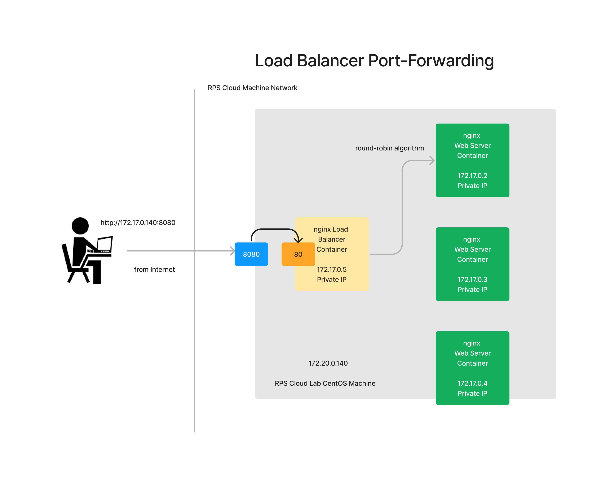

# Day 2

## What is dual/multi booting?
- Using Boot Loader Utility, we should be able to support multiple OS in the Laptop/Desktop
- with Boot Loader Utility, only one OS can be active at a time
- Example:-
  - LILO
  - GRUB 

## What is Hypervisor?
- is Virtualization Technology
- helps us run multiple OS in the same Server/Workstation/Dekstop/Laptop etc.,
- the benefit is many OS can be active at the same time in the same machine
- for this to work, the Server/Workstation/Desktop/Laptop should have a Processor that supports Virtualization
- Intel Processor
  - Virtualization Feature is called VT-X
- AMD Processor
  - Virtualization Feature is called AMD-V
- there are two types of Hypervisors
  1. Type 1 ( Used in Servers/Workstations - Bare-metal without OS)
  2. Type 2 ( Used in Wokstations/Desktops/Laptors - with a Host OS )
- Examples of Hypervisor Softwares
- VMWare
  - Fusion ( Mac OS-X - Laptops/Desktops )
  - Workstation ( Windows, Linux  - Laptops/Desktop)
  - vSphere/vCenter ( Bare-metal Type 1 Hypervisor - Servers )
- Microsoft
  - Hyper-V ( Type 2  - Laptops/Desktops )
- Parallels ( Mac OS-X  - Laptops/Desktops )
- KVM ( Kernel Virtual Manager - Linux )
- each OS that is installed on top on the Hypervisor is called Guest OS or Virtual Machines
- Each Virtual machine(VM) gets its dedicated Hardware resources ( CPU Cores, RAM, Disk, Network Card[Virtual], Graphics Card[Virtual] )
- As every VM requires dedicated Hardware resources, they are called heavy-weight Virtualization Technology
- The number of VMs a Server/Destop/Workstation/Laptop can support is limited by number of CPU Cores the machine has, RAM, Disk, etc.,

## Hypervisor High Level Architecture

## Hypevisor vs Container

## Docker Overview

## Docker Alternatives

## What is a Docker Image?

## What is a Docker Container?

## Docker Registries

## Docker High Level Architecture


# Docker Commands

## Finding the docker version
```
docker --version
```

Expected output
<pre>
jegan@tektutor:~/devops-june-2023/Day2$ <b>docker --version</b>
Docker version 20.10.21, build 20.10.21-0ubuntu1~22.04.3
</pre>

## Finding details about your docker installation
```
docker info
```

Expected output
<pre>
egan@tektutor:~/devops-june-2023/Day2$ docker info
Client:
 Context:    default
 Debug Mode: false

Server:
 Containers: 1
  Running: 0
  Paused: 0
  Stopped: 1
 Images: 14
 Server Version: 20.10.21
 Storage Driver: overlay2
  Backing Filesystem: extfs
  Supports d_type: true
  Native Overlay Diff: true
  userxattr: false
 Logging Driver: json-file
 Cgroup Driver: systemd
 Cgroup Version: 2
 Plugins:
  Volume: local
  Network: bridge host ipvlan macvlan null overlay
  Log: awslogs fluentd gcplogs gelf journald json-file local logentries splunk syslog
 Swarm: inactive
 Runtimes: io.containerd.runc.v2 io.containerd.runtime.v1.linux runc
 Default Runtime: runc
 Init Binary: docker-init
 containerd version: 
 runc version: 
 init version: 
 Security Options:
  apparmor
  seccomp
   Profile: default
  cgroupns
 Kernel Version: 5.19.0-43-generic
 Operating System: Ubuntu 22.04.2 LTS
 OSType: linux
 Architecture: x86_64
 CPUs: 48
 Total Memory: 125.5GiB
 Name: tektutor
 ID: WZA5:L6SA:D632:2LST:SLSS:TB3Y:AH7U:WLES:OL7T:G2TT:7TES:QLY2
 Docker Root Dir: /var/lib/docker
 Debug Mode: false
 Registry: https://index.docker.io/v1/
 Labels:
 Experimental: false
 Insecure Registries:
  127.0.0.0/8
 Live Restore Enabled: false
</pre>

## Listing the docker images in the local docker registry
```
docker images
```

Expected output
<pre>
jegan@tektutor:~/devops-june-2023/Day2$ <b>docker images</b>
REPOSITORY                                   TAG            IMAGE ID       CREATED       SIZE
tektutor/java                                1.0            3dec350d1b8d   4 days ago    416MB
tektutor/hello                               1.0            f0652e271e67   4 days ago    416MB
localhost:5000/tektutor-ubuntu               22.04          8af846fe34ca   7 days ago    729MB
bitnami/nginx                                latest         7a094f97a968   7 days ago    92.2MB
registry                                     2              65f3b3441f04   3 weeks ago   24MB
ubuntu                                       22.04          3b418d7b466a   5 weeks ago   77.8MB
registry.access.redhat.com/ubi8/openjdk-11   latest         d1ce871371c2   6 weeks ago   394MB
maven                                        3.6.3-jdk-11   e23b595c92ad   2 years ago   658MB
docker.bintray.io/jfrog/artifactory-oss      6.23.13        6106bdbbf79d   2 years ago   743MB
k8s.gcr.io/pause                             3.1            da86e6ba6ca1   5 years ago   742kB
</pre>

## Downloading docker image from Docker Hub Remote Registry to Local Docker Registry
```
docker pull hello-world:latest
```

Expected output
<pre>
jegan@tektutor:~/devops-june-2023/Day2$ <b>docker pull hello-world:latest</b>
latest: Pulling from library/hello-world
719385e32844: Pull complete 
Digest: sha256:fc6cf906cbfa013e80938cdf0bb199fbdbb86d6e3e013783e5a766f50f5dbce0
Status: Downloaded newer image for hello-world:latest
docker.io/library/hello-world:latest

jegan@tektutor:~/devops-june-2023/Day2$ <b>docker images</b>
REPOSITORY                                   TAG            IMAGE ID       CREATED       SIZE
tektutor/java                                1.0            3dec350d1b8d   4 days ago    416MB
tektutor/hello                               1.0            f0652e271e67   4 days ago    416MB
localhost:5000/tektutor-ubuntu               22.04          8af846fe34ca   7 days ago    729MB
bitnami/nginx                                latest         7a094f97a968   7 days ago    92.2MB
registry                                     2              65f3b3441f04   3 weeks ago   24MB
hello-world                                  latest         9c7a54a9a43c   4 weeks ago   13.3kB
ubuntu                                       22.04          3b418d7b466a   5 weeks ago   77.8MB
registry.access.redhat.com/ubi8/openjdk-11   latest         d1ce871371c2   6 weeks ago   394MB
maven                                        3.6.3-jdk-11   e23b595c92ad   2 years ago   658MB
docker.bintray.io/jfrog/artifactory-oss      6.23.13        6106bdbbf79d   2 years ago   743MB
k8s.gcr.io/pause                             3.1            da86e6ba6ca1   5 years ago   742kB
</pre>

## Lab - Deleting a docker image from Docker local registry
```
docker rmi hello-world:latest
```
Expected output
<pre>
jegan@tektutor:~/devops-june-2023/Day2$ <b>docker rmi hello-world:latest</b>
Untagged: hello-world:latest
Untagged: hello-world@sha256:fc6cf906cbfa013e80938cdf0bb199fbdbb86d6e3e013783e5a766f50f5dbce0
Deleted: sha256:9c7a54a9a43cca047013b82af109fe963fde787f63f9e016fdc3384500c2823d
Deleted: sha256:01bb4fce3eb1b56b05adf99504dafd31907a5aadac736e36b27595c8b92f07f1

jegan@tektutor:~/devops-june-2023/Day2$ <b>docker images</b>
REPOSITORY                                   TAG            IMAGE ID       CREATED       SIZE
tektutor/java                                1.0            3dec350d1b8d   4 days ago    416MB
tektutor/hello                               1.0            f0652e271e67   4 days ago    416MB
localhost:5000/tektutor-ubuntu               22.04          8af846fe34ca   7 days ago    729MB
bitnami/nginx                                latest         7a094f97a968   7 days ago    92.2MB
registry                                     2              65f3b3441f04   3 weeks ago   24MB
ubuntu                                       22.04          3b418d7b466a   5 weeks ago   77.8MB
registry.access.redhat.com/ubi8/openjdk-11   latest         d1ce871371c2   6 weeks ago   394MB
maven                                        3.6.3-jdk-11   e23b595c92ad   2 years ago   658MB
docker.bintray.io/jfrog/artifactory-oss      6.23.13        6106bdbbf79d   2 years ago   743MB
k8s.gcr.io/pause                             3.1            da86e6ba6ca1   5 years ago   742kB
</pre>

## Lab - Create a container and run it in the background
```
docker run -dit --name ubuntu1 --hostname ubuntu1 ubuntu:22.04 /bin/bash
```

Once the start the container, you may list running containers and see if the ubuntu1 container is running
```
docker ps
```

Expected output
<pre>
jegan@tektutor:~/devops-june-2023/Day2$ <b>docker run -dit --name ubuntu1 --hostname ubuntu1 ubuntu:22.04 /bin/bash</b>
bc3c746dfb14e25f41da5f7716e2147bbd72ce4fc8074fe55d2cfa65fbb354cf

jegan@tektutor:~/devops-june-2023/Day2$ <b>docker ps</b>
CONTAINER ID   IMAGE          COMMAND       CREATED         STATUS         PORTS     NAMES
bc3c746dfb14   ubuntu:22.04   "/bin/bash"   4 seconds ago   Up 3 seconds             ubuntu1
</pre>

## Lab - Getting inside a container that runs in background
```
docker ps
docker exec -it ubuntu1 /bin/bash
hostname
hostname -i
exit
```

Expected output
<pre>
egan@tektutor:~/devops-june-2023/Day2$ <b>docker ps</b>
CONTAINER ID   IMAGE          COMMAND       CREATED          STATUS          PORTS     NAMES
bc3c746dfb14   ubuntu:22.04   "/bin/bash"   28 minutes ago   Up 28 minutes             ubuntu1

jegan@tektutor:~/devops-june-2023/Day2$ <b>docker exec -it ubuntu1 /bin/bash</b>
root@ubuntu1:/# ls
bin   dev  home  lib32  libx32  mnt  proc  run   srv  tmp  var
boot  etc  lib   lib64  media   opt  root  sbin  sys  usr
root@ubuntu1:/# hostname
ubuntu1
root@ubuntu1:/# hostname -i
172.17.0.2
root@ubuntu1:/# exit
exit

jegan@tektutor:~/devops-june-2023/Day2$ <b>docker ps</b>
CONTAINER ID   IMAGE          COMMAND       CREATED          STATUS          PORTS     NAMES
bc3c746dfb14   ubuntu:22.04   "/bin/bash"   31 minutes ago   Up 31 minutes             ubuntu1
</pre>


## Lab - Creating a mysql container and run it in background
```
docker run -d --name mysql --hostname mysql -e MYSQL_ROOT_PASSWORD mysql:latest
```

Expected output
<pre>
jegan@tektutor:~/devops-june-2023/Day2$ <b>docker run -d --name mysql --hostname mysql -e MYSQL_ROOT_PASSWORD=root@123 mysql:latest</b>
Unable to find image 'mysql:latest' locally
latest: Pulling from library/mysql
3e0c3751e648: Pull complete 
7914193c6f0e: Pull complete 
fe4b3f820487: Pull complete 
63683b304e3d: Pull complete 
6ad9069836bd: Pull complete 
de90cd4c0e5d: Pull complete 
892e565e2cf0: Pull complete 
73057d123da0: Pull complete 
af1a3c0ec34e: Pull complete 
62fe8dc4ffe9: Pull complete 
8807488ae889: Pull complete 
Digest: sha256:4bae98614cd6ad1aecbdd32ff1b37b93fb0ee22b069469e7bc9679bacef1abd2
Status: Downloaded newer image for mysql:latest
d1a50ac156ffa43db82a2dcb79a63cfd309bcb4bf571d20093e1bc13be3ac4b5

jegan@tektutor:~/devops-june-2023/Day2$ <b>docker ps</b>
CONTAINER ID   IMAGE          COMMAND                  CREATED         STATUS         PORTS                 NAMES
d1a50ac156ff   mysql:latest   "docker-entrypoint.s…"   4 seconds ago   Up 3 seconds   3306/tcp, 33060/tcp   mysql

jegan@tektutor:~/devops-june-2023/Day2$ docker exec -it mysql /bin/bash
bash-4.4# hostname
bash: hostname: command not found
bash-4.4# mysql -u root -p
Enter password: 
Welcome to the MySQL monitor.  Commands end with ; or \g.
Your MySQL connection id is 8
Server version: 8.0.33 MySQL Community Server - GPL

Copyright (c) 2000, 2023, Oracle and/or its affiliates.

Oracle is a registered trademark of Oracle Corporation and/or its
affiliates. Other names may be trademarks of their respective
owners.

Type 'help;' or '\h' for help. Type '\c' to clear the current input statement.

mysql> SHOW DATABASES;
+--------------------+
| Database           |
+--------------------+
| information_schema |
| mysql              |
| performance_schema |
| sys                |
+--------------------+
4 rows in set (0.01 sec)

mysql> CREATE DATABASE tektutor;
Query OK, 1 row affected (0.00 sec)

mysql> USE tektutor;
Database changed
mysql> SHOW TABLES;
Empty set (0.01 sec)

mysql> CREATE TABLE training ( id INT NOT NULL, name VARCHAR(200), duration VARCHAR(200), PRIMARY KEY(id) );
Query OK, 0 rows affected (0.02 sec)

mysql> INSERT INTO training VALUES ( 1, "DevOps", "5 Days" );
Query OK, 1 row affected (0.02 sec)

mysql> INSERT INTO training VALUES ( 2, "Microservices", "5 Days" );
Query OK, 1 row affected (0.00 sec)

mysql> INSERT INTO training VALUES ( 3, "Red Hat OpenShift", "5 Days" );
Query OK, 1 row affected (0.01 sec)

mysql> SELECT * FROM training;
+----+-------------------+----------+
| id | name              | duration |
+----+-------------------+----------+
|  1 | DevOps            | 5 Days   |
|  2 | Microservices     | 5 Days   |
|  3 | Red Hat OpenShift | 5 Days   |
+----+-------------------+----------+
3 rows in set (0.00 sec)

mysql> exit
Bye
bash-4.4# exit
exit
</pre>

## Lab - Storing mysql database in an external volume
```
docker rm -f mysql
mkdir -p /tmp/mysql
docker run -d --name mysql --hostname mysql -e MYSQL_ROOT_PASSWORD=root@123 -v /tmp/mysql:/var/lib/mysql mysql:latest
```

In the above run command, the path /tmp/mysql is on the local machine. While the path /var/lib/mysql is inside the container which acts like a mount point.

Let's get inside the mysql container
```
docker exec -it mysql sh
CREATE DATABASE tektutor;
USE tektutor;
CREATE TABLE training ( id INT NOT NULL, name VARCHAR(200), duration VARCHAR(200), PRIMARY KEY (id) );
INSERT INTO training VALUES ( 1, "DevOps", "5 Days" );
exit
exit
```

Let delete the mysql container
```
docker rm -f mysql
```

Let's create a new mysql container
```
docker run -d --name mysql --hostname mysql -e MYSQL_ROOT_PASSWORD=root@123 -v /tmp/mysql:/var/lib/mysql mysql:latest
```

Let's get inside the mysql container
```
docker exec -it mysql sh
SHOW DATABASES;
USE tektutor;
SHOW TABLES;
SELECT * FROM training;
```

## Lab - Inspecting docker images 
```
docker image inspect nginx:latest
```
Expected output
<pre>
jegan@tektutor:~/devops-june-2023/Day2$ docker image inspect nginx:latest
[
    {
        "Id": "sha256:f9c14fe76d502861ba0939bc3189e642c02e257f06f4c0214b1f8ca329326cda",
        "RepoTags": [
            "nginx:latest"
        ],
        "RepoDigests": [
            "nginx@sha256:af296b188c7b7df99ba960ca614439c99cb7cf252ed7bbc23e90cfda59092305"
        ],
        "Parent": "",
        "Comment": "",
        "Created": "2023-05-24T22:43:48.18207587Z",
        "Container": "23b0fce2f40be83daa129eacbf79b8a57c6524a7898bf3aba06e10c15b433d0d",
        "ContainerConfig": {
            "Hostname": "23b0fce2f40b",
            "Domainname": "",
            "User": "",
            "AttachStdin": false,
            "AttachStdout": false,
            "AttachStderr": false,
            "ExposedPorts": {
                "80/tcp": {}
            },
            "Tty": false,
            "OpenStdin": false,
            "StdinOnce": false,
            "Env": [
                "PATH=/usr/local/sbin:/usr/local/bin:/usr/sbin:/usr/bin:/sbin:/bin",
                "NGINX_VERSION=1.25.0",
                "NJS_VERSION=0.7.12",
                "PKG_RELEASE=1~bullseye"
            ],
            "Cmd": [
                "/bin/sh",
                "-c",
                "#(nop) ",
                "CMD [\"nginx\" \"-g\" \"daemon off;\"]"
            ],
            "Image": "sha256:a14a5803cbf095a0268663fe3235681c2f7fd5d0b59c242d99e7b1ebb59284f3",
            "Volumes": null,
            "WorkingDir": "",
            "Entrypoint": [
                "/docker-entrypoint.sh"
            ],
            "OnBuild": null,
            "Labels": {
                "maintainer": "NGINX Docker Maintainers <docker-maint@nginx.com>"
            },
            "StopSignal": "SIGQUIT"
        },
        "DockerVersion": "20.10.23",
        "Author": "",
        "Config": {
            "Hostname": "",
            "Domainname": "",
            "User": "",
            "AttachStdin": false,
            "AttachStdout": false,
            "AttachStderr": false,
            "ExposedPorts": {
                "80/tcp": {}
            },
            "Tty": false,
            "OpenStdin": false,
            "StdinOnce": false,
            "Env": [
                "PATH=/usr/local/sbin:/usr/local/bin:/usr/sbin:/usr/bin:/sbin:/bin",
                "NGINX_VERSION=1.25.0",
                "NJS_VERSION=0.7.12",
                "PKG_RELEASE=1~bullseye"
            ],
            "Cmd": [
                "nginx",
                "-g",
                "daemon off;"
            ],
            "Image": "sha256:a14a5803cbf095a0268663fe3235681c2f7fd5d0b59c242d99e7b1ebb59284f3",
            "Volumes": null,
            "WorkingDir": "",
            "Entrypoint": [
                "/docker-entrypoint.sh"
            ],
            "OnBuild": null,
            "Labels": {
                "maintainer": "NGINX Docker Maintainers <docker-maint@nginx.com>"
            },
            "StopSignal": "SIGQUIT"
        },
        "Architecture": "amd64",
        "Os": "linux",
        "Size": 142560184,
        "VirtualSize": 142560184,
        "GraphDriver": {
            "Data": {
                "LowerDir": "/var/lib/docker/overlay2/32e5484d05e2b12f6fd57ccd78fefcb0c453cb79a740183c41c8016c214b1ca4/diff:/var/lib/docker/overlay2/13a7227f7a6543785ffbd62f505eabe041db6b3e4809410ed5bef6cdc0be73da/diff:/var/lib/docker/overlay2/dd4be5c55d580c43f3e6307d381e9d8a5b24c3bdb37cda1e049862004d28bc75/diff:/var/lib/docker/overlay2/40f65b05ccb9b0d73b56e242739d68c182e0d88567b6624e762476abc970fa00/diff:/var/lib/docker/overlay2/2b821f24747675a8a5e557848496c6701c15de630dd5c3a83371042fedd11b95/diff",
                "MergedDir": "/var/lib/docker/overlay2/a891d81076abf2d2f8c4ca19737bf2880c168f79ad091dbc973b8feceedb9634/merged",
                "UpperDir": "/var/lib/docker/overlay2/a891d81076abf2d2f8c4ca19737bf2880c168f79ad091dbc973b8feceedb9634/diff",
                "WorkDir": "/var/lib/docker/overlay2/a891d81076abf2d2f8c4ca19737bf2880c168f79ad091dbc973b8feceedb9634/work"
            },
            "Name": "overlay2"
        },
        "RootFS": {
            "Type": "layers",
            "Layers": [
                "sha256:8cbe4b54fa88d8fc0198ea0cc3a5432aea41573e6a0ee26eca8c79f9fbfa40e3",
                "sha256:4b8862fe7056d8a3c2c0910eb38ebb8fc08785eaa1f9f53b2043bf7ca8adbafb",
                "sha256:e60266289ce4a890aaf52b93228090998e28220aef04f128704141864992dd15",
                "sha256:7daac92f43be84ad9675f94875c1a00357b975d6c58b11d17104e0a0e04da370",
                "sha256:5e099cf3f3c83c449b8c062f944ac025c9bf2dd7ec255837c53430021f5a1517",
                "sha256:4fd83434130318dede62defafcc5853d03dae8636eccfa1b9dcd385d92e3ff19"
            ]
        },
        "Metadata": {
            "LastTagTime": "0001-01-01T00:00:00Z"
        }
    }
]
</pre>

## Lab - Creating container in interactive/foreground mode
```
docker run -it --name ubuntu1 --hostname ubuntu1 ubuntu:22.04 /bin/bash
```

Expected output
<pre>
jegan@tektutor:~/devops-june-2023/Day2$ <b>docker run -it --name ubuntu1 --hostname ubuntu2 ubuntu:22.04 /bin/bash</b>

root@ubuntu2:/# <b>hostname</b>
ubuntu2

root@ubuntu2:/# <b>hostname -i</b>
172.17.0.6

root@ubuntu2:/# <b>ls</b>
bin  boot  dev  etc  home  lib  lib32  lib64  libx32  media  mnt  opt  proc  root  run  sbin  srv  sys  tmp  usr  var
root@ubuntu2:/# <b>exit</b>
exit

jegan@tektutor:~/devops-june-2023/Day2$ <b>docker ps</b>
CONTAINER ID   IMAGE          COMMAND                  CREATED          STATUS          PORTS     NAMES
ba719422ef86   nginx:latest   "/docker-entrypoint.…"   43 minutes ago   Up 32 minutes   80/tcp    lb
19840193f320   nginx:latest   "/docker-entrypoint.…"   43 minutes ago   Up 43 minutes   80/tcp    nginx3
19adada80e33   nginx:latest   "/docker-entrypoint.…"   43 minutes ago   Up 43 minutes   80/tcp    nginx2
60414edbf0ed   nginx:latest   "/docker-entrypoint.…"   43 minutes ago   Up 43 minutes   80/tcp    nginx1

jegan@tektutor:~/devops-june-2023/Day2$ <b>docker ps -a</b>
CONTAINER ID   IMAGE          COMMAND                  CREATED          STATUS                      PORTS     NAMES
85df1b51e762   ubuntu:22.04   "/bin/bash"              39 seconds ago   Exited (0) 11 seconds ago             ubuntu1
ba719422ef86   nginx:latest   "/docker-entrypoint.…"   43 minutes ago   Up 32 minutes               80/tcp    lb
19840193f320   nginx:latest   "/docker-entrypoint.…"   43 minutes ago   Up 43 minutes               80/tcp    nginx3
19adada80e33   nginx:latest   "/docker-entrypoint.…"   43 minutes ago   Up 43 minutes               80/tcp    nginx2
60414edbf0ed   nginx:latest   "/docker-entrypoint.…"   43 minutes ago   Up 43 minutes               80/tcp    nginx1
</pre>


## Lab - Setting up a load-balancer with nginx image and do port-forwarding on the lb container



Let's delete all existing containers
```
docker rm -f $(docker ps -aq)
```

Let's create 3 nginx container that we would use as a web server
```
docker run -d --name nginx1 --hostname nginx1 nginx:latest
docker run -d --name nginx2 --hostname nginx2 nginx:latest
docker run -d --name nginx3 --hostname nginx3 nginx:latest
```

Let's now create a 4th container, that we wish to configure to work like a load balancer
```
docker run -d --name lb --hostname lb nginx:latest
```

Let's list and see if all 4 containers are running
```
docker ps
```

Expected output
<pre>
jegan@tektutor:~/devops-june-2023/Day2$ <b>docker ps</b>
CONTAINER ID   IMAGE          COMMAND                  CREATED          STATUS          PORTS     NAMES
ba719422ef86   nginx:latest   "/docker-entrypoint.…"   16 minutes ago   Up 6 minutes    80/tcp    lb
19840193f320   nginx:latest   "/docker-entrypoint.…"   16 minutes ago   Up 16 minutes   80/tcp    nginx3
19adada80e33   nginx:latest   "/docker-entrypoint.…"   16 minutes ago   Up 16 minutes   80/tcp    nginx2
60414edbf0ed   nginx:latest   "/docker-entrypoint.…"   17 minutes ago   Up 17 minutes   80/tcp    nginx1
</pre>

In order to configure lb container to work like Load Balancer, let's copy the nginx.conf file from lb container to local machine
```
docker cp lb:/etc/nginx/nginx.conf .
ls
```

Now let's modify the nginx.conf as show below

```

user  nginx;
worker_processes  auto;

error_log  /var/log/nginx/error.log notice;
pid        /var/run/nginx.pid;


events {
    worker_connections  1024;
}

http {
    upstream backend {
        server 172.17.0.2:80;
        server 172.17.0.3:80;
        server 172.17.0.4:80;
    }
    
    server {
        location / {
            proxy_pass http://backend;
        }
    }
}
```

In the above file, 172.17.0.2 is the IP Address of the nginx1 container, 172.17.0.3 is the IP Address of the nginx2 container and 172.17.0.4 is the IP address of the nginx3 container.

In case, you wish to check your nginx container IPs, you may do so as shown below
```
docker inspect nginx1 | grep IPA
docker inspect -f {{.NetworkSettings.IPAddress}} nginx2 
docker inspect nginx3 | grep IPA
```

Expected output
<pre>
jegan@tektutor:~/devops-june-2023/Day2$ <b>docker inspect nginx1 | grep IPA</b>
            "SecondaryIPAddresses": null,
            "IPAddress": "172.17.0.2",
                    "IPAMConfig": null,
                    "IPAddress": "172.17.0.2",

jegan@tektutor:~/devops-june-2023/Day2$ <b>docker inspect -f {{.NetworkSettings.IPAddress}} nginx2</b>
172.17.0.3

jegan@tektutor:~/devops-june-2023/Day2$ <b>docker inspect nginx3 | grep IPA</b>
            "SecondaryIPAddresses": null,
            "IPAddress": "172.17.0.4",
                    "IPAMConfig": null,
                    "IPAddress": "172.17.0.4",
</pre>

Now, we need to copy the nginx.conf file back into the lb container
```
docker cp nginx.conf lb:/etc/nginx/nginx.conf
```

To appy the config changes, we need to restart the lb container
```
docker restart lb
```

Also, make sure your lb container is running after you made the config changes
```
docker ps
```

If all went well, you may customize the index.html file to report customized message, so that we can figure out from which nginx container the response is comming.

```
echo "Nginx Web Server 1" > index.html
docker cp index.html nginx1:/usr/share/nginx/html/index.html

echo "Nginx Web Server 2" > index.html
docker cp index.html nginx2:/usr/share/nginx/html/index.html

echo "Nginx Web Server 3" > index.html
docker cp index.html nginx3:/usr/share/nginx/html/index.html
```

You my access your lb container IP from your RPS machine web browser
```
http://172.17.0.5
```
Assuming, 172.17.0.5 is the IP Address of your lb container. In case it is different, just try with your lb container IP.

In order to check if the port-forwarding is working fine.  Find your lab machine ip
```
ifconfig ens192
```

Then you can access the lb as shown below
```
http://172.20.0.144:8080
http://172.20.0.144:8080
http://172.20.0.144:8080
```
